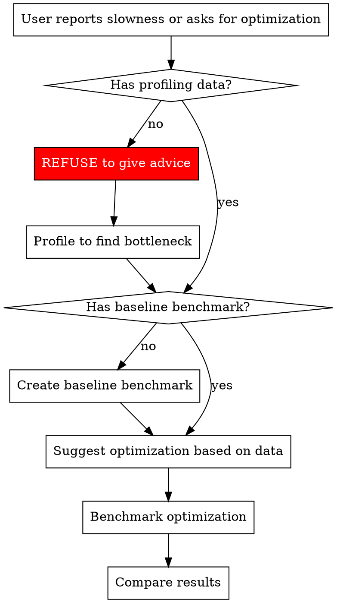

# Performance Analysis for Elixir/Phoenix

## Overview

**Type:** Technique (Discipline-Enforcing)

**Never optimize without profiling data.** Code review cannot tell you where bottlenecks are—only measurement can.

## The Iron Law

```
NO OPTIMIZATION WITHOUT PROFILING DATA
```

**Before suggesting ANY optimization:**
1. Profile to identify bottlenecks
2. Create benchmarks for current state
3. Only then suggest changes
4. Benchmark again to verify improvement

**No exceptions:**
- Not for "obvious" improvements
- Not for "best practices"
- Not for code that "looks slow"
- Not when user is confident they know the problem

## Red Flags - STOP and Profile First

These thoughts mean STOP—you're about to violate measurement discipline:

| Thought | Reality |
|---------|---------|
| "I can identify optimization opportunities" | Code review ≠ profiling. Measure first. |
| "This is obviously slow" | Obvious to you ≠ actual bottleneck. Profile. |
| "Multiple Enum passes are inefficient" | Maybe. Measure to confirm. |
| "Stream would be faster" | Maybe not. Benchmark both. |
| "The user knows it's an N+1 problem" | Users guess wrong. Verify with profiling. |
| "I would profile if I had access" | You do. Insist on profiling before proceeding. |
| "Let me explain how to profile" | Don't explain. Insist on actual profiling. |

**All of these mean: Refuse to suggest optimizations. Profile first.**

## Performance Investigation Escalation Ladder

Start at the top. Only move down when the current level doesn't explain the problem.

### Level 0: Measure Before Anything

Before touching code, establish what "slow" means.

| Question | How to Answer | Tool |
|----------|---------------|------|
| Is it actually slow? | Get a number, not a feeling | `Benchee.run` with current code |
| How slow? | Wall-clock time for the operation | `:timer.tc/1` or `Benchee` |
| Slow for whom? | User-facing latency vs background job throughput | Application metrics, Telemetry |
| How often? | Once per request? Once per deploy? | Logging, `:telemetry.attach` |

```elixir
# Quick wall-clock measurement
{microseconds, result} = :timer.tc(fn -> MyModule.slow_function(input) end)
IO.puts("#{microseconds / 1000}ms")

# Repeatable baseline with Benchee
Benchee.run(%{"current" => fn -> MyModule.slow_function(input) end},
  warmup: 2, time: 5, memory_time: 2)
```

**Move to Level 1 when**: You have a number and it's too high.

### Level 1: Profile to Find the Bottleneck

Don't guess. Let the profiler tell you where time is spent.

| What You Need to Know | Tool | Command |
|-----------------------|------|---------|
| Which functions are called most? | cprof | `mix profile.cprof -e "Code.here()"` |
| Which functions take the most time? | eprof | `mix profile.eprof -e "Code.here()"` |
| Detailed call tree with time per call | fprof | `mix profile.fprof -e "Code.here()"` |
| Where is memory allocated? | tprof (OTP 27+) | `mix profile.tprof -e "Code.here()" --type memory` |
| Is the database the bottleneck? | Ecto telemetry / query logs | `config :my_app, MyApp.Repo, log: :debug` |

```elixir
# Profile in-process (eprof — good default starting point)
:eprof.start()
:eprof.start_profiling([self()])
MyModule.slow_function(input)
:eprof.stop_profiling()
:eprof.analyze()

# Profile with mix task
# mix profile.eprof -e "MyModule.slow_function(test_input)"
```

**Wrong tool = wrong conclusions:**
- fprof measures TIME, not memory
- cprof counts CALLS, not time
- eprof overhead is lower than fprof — start with eprof, use fprof only when you need call trees

**Move to Level 2 when**: Profiler shows where the time goes and it's CPU-bound application code.

### Level 2: Algorithmic and Data Structure Fixes

The highest-leverage fixes. A better algorithm beats any micro-optimization.

| Profiler Shows | Likely Cause | Fix | Verify With |
|----------------|-------------|-----|-------------|
| O(n) function called in O(n) loop | O(n²) hidden complexity | Replace inner lookup with Map/MapSet (O(1)) | Benchee with increasing input sizes |
| `Enum.member?/2` on large list | O(n) membership test | Switch to MapSet | Benchee |
| List append (`++`) in loop | O(n) per append, O(n²) total | Prepend + `Enum.reverse/1`, or use `:queue` | Benchee |
| Repeated Enum.filter/map chains | Multiple passes over same data | Single `Enum.reduce/3` or `for` comprehension | Benchee |
| Sorting inside a loop | O(n log n) repeated unnecessarily | Sort once outside loop, or maintain sorted structure | Benchee |

```elixir
# Confirm quadratic growth with increasing inputs
Benchee.run(
  %{"current" => fn input -> MyModule.slow_function(input) end},
  inputs: %{
    "100 items" => Enum.to_list(1..100),
    "1,000 items" => Enum.to_list(1..1_000),
    "10,000 items" => Enum.to_list(1..10_000)
  }
)
# If 10K is 100× slower than 1K (not 10×), you have O(n²)
```

**Move to Level 3 when**: Algorithm is already efficient but throughput is still insufficient.

### Level 3: BEAM-Specific Optimizations

Leverage the BEAM's strengths for the type of work being done.

| Bottleneck Type | Solution | OTP/Library |
|-----------------|----------|-------------|
| CPU-bound, embarrassingly parallel | Parallel processing | `Task.async_stream/3` |
| I/O-bound (HTTP, DB) waiting | Concurrent requests | `Task.async_stream/3`, connection pooling |
| Large data, can't fit in memory | Streaming / chunking | `Stream`, `Repo.stream/1`, `Flow` |
| Hot GenServer bottleneck | Reduce process contention | ETS for reads, `:atomics` for counters |
| Frequent small allocations | Reduce garbage collection | ETS, `:persistent_term` for read-heavy data |
| JSON encoding/decoding | Faster library | `Jason` (already fast), or `:jiffy` NIF for extreme cases |
| Serialization overhead | Binary protocol | `:erlang.term_to_binary/1`, Protocol Buffers |

```elixir
# Task.async_stream — parallelize independent work
results =
  items
  |> Task.async_stream(&process_item/1, max_concurrency: System.schedulers_online())
  |> Enum.map(fn {:ok, result} -> result end)

# Stream — process large data without loading all into memory
File.stream!("large.csv")
|> Stream.map(&parse_line/1)
|> Stream.filter(&valid?/1)
|> Enum.take(100)

# ETS — eliminate GenServer read bottleneck
:ets.new(:hot_cache, [:named_table, :public, read_concurrency: true])
:ets.insert(:hot_cache, {"key", value})
:ets.lookup(:hot_cache, "key")
```

**Move to Level 4 when**: Application code is optimized but you need system-level tuning.

### Level 4: Database and I/O Optimization

Most real-world slowness lives in I/O, not application code.

| Symptom | Solution | How to Verify |
|---------|----------|---------------|
| N+1 queries | `Repo.preload/2` or join | Check query count in logs before/after |
| Slow query | Add index | `EXPLAIN ANALYZE` in psql |
| Too many queries | Batch with `Ecto.Multi` or `insert_all` | Query count in logs |
| Large result sets | Pagination, `Repo.stream/1` | Memory usage before/after |
| Connection pool exhaustion | Increase pool size or reduce checkout time | `DBConnection` pool metrics |
| External API latency | Cache responses, circuit breaker | `Cachex` TTL, `Fuse` |

```elixir
# Preload to eliminate N+1
users = Repo.all(from u in User, preload: [:profile, :orders])

# Batch insert instead of N individual inserts
Repo.insert_all(Order, orders_params)

# Index for frequently filtered columns
create index(:orders, [:user_id, :status])
```

**Move to Level 5 when**: Single-node optimizations are exhausted and you need horizontal scaling.

### Level 5: System-Level and Infrastructure Tuning

Last resort. Most applications never need this.

| Bottleneck | Solution | When Justified |
|-----------|----------|----------------|
| BEAM scheduler contention | `+S` flag to tune schedulers | Profiling shows scheduler saturation |
| GC pauses in critical path | Move hot data to ETS/`:persistent_term` | Measured GC impact with `:erlang.garbage_collect` timing |
| NIF for CPU-intensive math | Rustler NIF | Benchee shows >10× improvement justifies FFI complexity |
| Distributed processing | `Flow` or `GenStage` pipelines | Single node can't keep up with data volume |
| Kernel/network tuning | TCP buffer sizes, connection limits | Load testing shows OS-level bottleneck |

**Tradeoff**: Significant operational complexity. Mis-tuning makes things worse. Always benchmark before and after.

### Escalation Decision Flowchart

```
Do you have a number for "how slow"?
  NO  → Level 0 (measure first)
  YES → Do you know WHERE the time is spent?
          NO  → Level 1 (profile)
          YES → Is it an algorithmic problem (O(n²)+)?
                  YES → Level 2 (algorithm/data structure fix)
                  NO  → Is it CPU-bound application code?
                          YES → Level 3 (BEAM optimizations)
                          NO  → Is it database/I/O?
                                  YES → Level 4 (DB/I/O optimization)
                                  NO  → Level 5 (system tuning)
```

## Tool Selection Based on What You're Measuring

| What to Measure | Tool | Command |
|----------------|------|---------|
| **Function call frequency** | cprof | `mix profile.cprof -e "Code.here()"` |
| **Time per function** | eprof/tprof | `mix profile.eprof -e "Code.here()"` |
| **Detailed time breakdown** | fprof | `mix profile.fprof -e "Code.here()"` |
| **Memory allocations** | tprof (OTP 27+) | `mix profile.tprof -e "Code.here()" --type memory` |
| **Comparison before/after** | Benchee | See benchmark template below |

**Wrong tool = wrong conclusions:**
- fprof measures TIME, not memory
- cprof counts CALLS, not time
- Use tprof --type memory for memory profiling

## Benchmark Template (Benchee)

```elixir
# Add to mix.exs: {:benchee, "~> 1.0", only: :dev}

Benchee.run(%{
  "current implementation" => fn ->
    CurrentModule.function(input)
  end,
  "proposed optimization" => fn ->
    OptimizedModule.function(input)
  end
}, 
  warmup: 2,
  time: 5,
  memory_time: 2
)
```

**CRITICAL:** Benchmark BEFORE changing code to establish baseline.

## The Correct Workflow



## Common Performance Patterns (After Profiling Shows These)

Only suggest these if profiling data confirms the problem:

### High Call Frequency
- **Symptom:** cprof shows function called 100,000+ times
- **Fix:** Reduce calls (caching, memoization) or optimize hot function

### Multiple Data Passes
- **Symptom:** eprof shows significant time in Enum.map chains
- **Fix:** Stream for large data, single-pass with reduce, or parallel processing

### Memory Pressure
- **Symptom:** tprof shows large allocations
- **Fix:** Stream processing, ETS tables, or chunking

### I/O Bound Operations
- **Symptom:** fprof shows time in database/network calls
- **Fix:** Parallel processing with Task.async_stream, connection pooling

### Database N+1 Queries
- **Symptom:** Database logs show 1 + N queries for associations
- **Fix:** Ecto.Repo.preload or custom joins

## Complexity Analysis for O(n²)+ Code

When profiling reveals slow code AND analysis shows O(n²) or worse complexity:

**Create Benchee benchmark with increasing input sizes:**

```elixir
Benchee.run(%{
  "current O(n²)" => fn n ->
    CurrentImplementation.function(1..n)
  end
}, 
  inputs: %{
    "100 items" => 100,
    "1,000 items" => 1000,
    "10,000 items" => 10_000
  }
)
```

If time increases quadratically with input size, algorithmic improvement is needed.

## BEAM Per-Process GC and Latency

BEAM garbage-collects each process independently. This is a strength (one process's GC doesn't pause another) but creates a trap: **a process with a large live heap will have long GC pauses**, causing latency spikes even when the rest of the system is fine (Jurić, "Reducing the maximum latency of a bound buffer").

**Diagnosis**: If profiling shows p99.9+ latency spikes concentrated in a single GenServer, check its heap size with `:erlang.process_info(pid, :heap_size)`. A process holding 200k+ live references will trigger multi-millisecond GC pauses.

**Mitigation techniques** (in order of preference):

1. **Offload data to ETS**: Store large collections in ETS tables instead of process state. ETS data lives outside the process heap and is freed immediately on deletion — no GC involvement. This can reduce max latency from ~37ms to ~300μs.

2. **Split into smaller processes**: A single process holding 200k items can be split into 20 processes holding 10k each. Each will GC faster, and GCs won't block each other.

3. **Preallocate heap for one-off jobs**: For temporary processes that allocate heavily, use `Process.spawn(fn -> ... end, [:link, {:min_heap_size, large_value}])` to avoid repeated heap expansion and GC during the job. The memory is reclaimed instantly when the process terminates.

4. **Use refc binaries**: Binaries >64 bytes are stored on a shared heap with reference counting, not on the process heap. If your data is naturally binary (strings, serialized data), this reduces per-process heap pressure automatically.

**Key insight**: The number of *GC runs* doesn't matter — what matters is the *duration* of each GC run, which is proportional to the live heap size.

## Refusing Without Profiling Data

When user asks for optimization advice without profiling:

**DON'T say:**
- "I would profile..."
- "You might want to profile..."
- "To properly verify, I recommend profiling..."

**DO say:**
- "I cannot suggest optimizations without profiling data. Let's profile first."
- "Profile first to identify the actual bottleneck."
- "Create a benchmark showing current performance before changing anything."

**Make profiling MANDATORY, not optional.**

## Validating "Improvements"

User claims code is faster after changes:

**REFUSE to confirm without benchmarks:**
1. "Show me the before and after benchmarks"
2. If no baseline exists, cannot verify improvement
3. "Should be faster" is not the same as "measured to be faster"

## Common Mistakes

| Mistake | Fix |
|---------|-----|
| Optimizing based on code review | Profile first, optimize what's actually slow |
| Using wrong profiling tool | Match tool to what you're measuring (time/memory/calls) |
| No baseline benchmark | Measure current state before changing anything |
| Assuming optimization worked | Benchmark after changes to verify |
| Profiling in dev instead of prod-like data | Use realistic data volumes and conditions |
| Optimizing O(1) code instead of O(n²) | Profile to find where time is actually spent |

## Real-World Example

**Wrong:**
```
User: "This module looks slow"
Agent: "Use Stream instead of Enum, and parallelize with Task.async_stream"
```

**Right:**
```
User: "This module looks slow"
Agent: "Let's profile it first to see where time is actually spent:
  mix profile.eprof -e 'MyModule.function(test_data)'
  
Then create a baseline benchmark:
  Benchee.run(%{"current" => fn -> MyModule.function(test_data) end})
  
Only after seeing profiling data can we identify the actual bottleneck."
```

## Tail Latency Reduction (After Profiling Confirms Latency Problem)

When profiling shows that p99/p999 latency is significantly worse than median, and the system fans out to multiple backends or partitions, these techniques reduce tail latency (Dean & Barroso, "The Tail at Scale"):

| Technique | How It Works | Overhead | When to Use |
|-----------|-------------|----------|-------------|
| **Hedged requests** | Send to backup after p95 timeout of primary | ~5% extra load | Fan-out queries to sharded data |
| **Tied requests** | Enqueue on multiple servers, cancel duplicates when one completes | Minimal with cancellation | Load-balanced worker pools |
| **Micro-partitioning** | 20× more partitions than servers for fine-grained rebalancing | Management complexity | Sharded stateful services |
| **Latency probation** | Temporarily exclude slow nodes, send shadow requests to monitor recovery | Shadow request load | Heterogeneous node fleet |
| **Canary requests** | Test on small subset before full fan-out | One extra round-trip | High fan-out queries (100+ nodes) |

```elixir
# Hedged request — send backup after p95 timeout
defmodule HedgedRequest do
  def query(nodes, request, opts \\ []) do
    p95_timeout = Keyword.get(opts, :hedge_after_ms, 50)

    primary = Enum.random(nodes)
    backup = Enum.random(nodes -- [primary])

    task1 = Task.async(fn -> rpc_call(primary, request) end)

    # Wait for primary up to p95 timeout
    case Task.yield(task1, p95_timeout) do
      {:ok, result} ->
        result
      nil ->
        # Primary is slow — hedge with backup
        task2 = Task.async(fn -> rpc_call(backup, request) end)
        case Task.yield_many([task1, task2], 5_000) do
          [{^task1, {:ok, r}}, _] -> Task.shutdown(task2, :brutal_kill); r
          [_, {^task2, {:ok, r}}] -> Task.shutdown(task1, :brutal_kill); r
          _ -> {:error, :timeout}
        end
    end
  end
end
```

**The key insight**: At scale, the slowest component in any fan-out determines overall latency. A single slow node turns a 10ms operation into a 10-second operation. These techniques bound the damage from slow outliers.

## Integration with Other Skills

- **Before optimizing:** Use THIS skill to profile and benchmark
- **When O(n²)+ detected:** Use algorithms skill to find better algorithms
- **After optimization:** Use verification-before-completion to confirm improvements
- **In code review:** Check that optimizations have benchmark data
