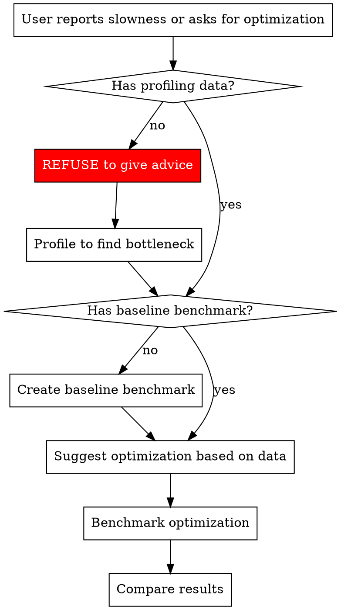

# Performance Analysis for Elixir/Phoenix

## Overview

**Never optimize without profiling data.** Code review cannot tell you where bottlenecks are—only measurement can.

## The Iron Law

```
NO OPTIMIZATION WITHOUT PROFILING DATA
```

**Before suggesting ANY optimization:**
1. Profile to identify bottlenecks
2. Create benchmarks for current state
3. Only then suggest changes
4. Benchmark again to verify improvement

**No exceptions:**
- Not for "obvious" improvements
- Not for "best practices"
- Not for code that "looks slow"
- Not when user is confident they know the problem

## Red Flags - STOP and Profile First

These thoughts mean STOP—you're about to violate measurement discipline:

| Thought | Reality |
|---------|---------|
| "I can identify optimization opportunities" | Code review ≠ profiling. Measure first. |
| "This is obviously slow" | Obvious to you ≠ actual bottleneck. Profile. |
| "Multiple Enum passes are inefficient" | Maybe. Measure to confirm. |
| "Stream would be faster" | Maybe not. Benchmark both. |
| "The user knows it's an N+1 problem" | Users guess wrong. Verify with profiling. |
| "I would profile if I had access" | You do. Insist on profiling before proceeding. |
| "Let me explain how to profile" | Don't explain. Insist on actual profiling. |

**All of these mean: Refuse to suggest optimizations. Profile first.**

## Tool Selection Based on What You're Measuring

| What to Measure | Tool | Command |
|----------------|------|---------|
| **Function call frequency** | cprof | `mix profile.cprof -e "Code.here()"` |
| **Time per function** | eprof/tprof | `mix profile.eprof -e "Code.here()"` |
| **Detailed time breakdown** | fprof | `mix profile.fprof -e "Code.here()"` |
| **Memory allocations** | tprof (OTP 27+) | `mix profile.tprof -e "Code.here()" --type memory` |
| **Comparison before/after** | Benchee | See benchmark template below |

**Wrong tool = wrong conclusions:**
- fprof measures TIME, not memory
- cprof counts CALLS, not time
- Use tprof --type memory for memory profiling

## Benchmark Template (Benchee)

```elixir
# Add to mix.exs: {:benchee, "~> 1.0", only: :dev}

Benchee.run(%{
  "current implementation" => fn ->
    CurrentModule.function(input)
  end,
  "proposed optimization" => fn ->
    OptimizedModule.function(input)
  end
}, 
  warmup: 2,
  time: 5,
  memory_time: 2
)
```

**CRITICAL:** Benchmark BEFORE changing code to establish baseline.

## The Correct Workflow



## Common Performance Patterns (After Profiling Shows These)

Only suggest these if profiling data confirms the problem:

### High Call Frequency
- **Symptom:** cprof shows function called 100,000+ times
- **Fix:** Reduce calls (caching, memoization) or optimize hot function

### Multiple Data Passes
- **Symptom:** eprof shows significant time in Enum.map chains
- **Fix:** Stream for large data, single-pass with reduce, or parallel processing

### Memory Pressure
- **Symptom:** tprof shows large allocations
- **Fix:** Stream processing, ETS tables, or chunking

### I/O Bound Operations
- **Symptom:** fprof shows time in database/network calls
- **Fix:** Parallel processing with Task.async_stream, connection pooling

### Database N+1 Queries
- **Symptom:** Database logs show 1 + N queries for associations
- **Fix:** Ecto.Repo.preload or custom joins

## Complexity Analysis for O(n²)+ Code

When profiling reveals slow code AND analysis shows O(n²) or worse complexity:

**Create Benchee benchmark with increasing input sizes:**

```elixir
Benchee.run(%{
  "current O(n²)" => fn n ->
    CurrentImplementation.function(1..n)
  end
}, 
  inputs: %{
    "100 items" => 100,
    "1,000 items" => 1000,
    "10,000 items" => 10_000
  }
)
```

If time increases quadratically with input size, algorithmic improvement is needed.

## Refusing Without Profiling Data

When user asks for optimization advice without profiling:

**DON'T say:**
- "I would profile..."
- "You might want to profile..."
- "To properly verify, I recommend profiling..."

**DO say:**
- "I cannot suggest optimizations without profiling data. Let's profile first."
- "Profile first to identify the actual bottleneck."
- "Create a benchmark showing current performance before changing anything."

**Make profiling MANDATORY, not optional.**

## Validating "Improvements"

User claims code is faster after changes:

**REFUSE to confirm without benchmarks:**
1. "Show me the before and after benchmarks"
2. If no baseline exists, cannot verify improvement
3. "Should be faster" is not the same as "measured to be faster"

## Common Mistakes

| Mistake | Fix |
|---------|-----|
| Optimizing based on code review | Profile first, optimize what's actually slow |
| Using wrong profiling tool | Match tool to what you're measuring (time/memory/calls) |
| No baseline benchmark | Measure current state before changing anything |
| Assuming optimization worked | Benchmark after changes to verify |
| Profiling in dev instead of prod-like data | Use realistic data volumes and conditions |
| Optimizing O(1) code instead of O(n²) | Profile to find where time is actually spent |

## Real-World Example

**Wrong:**
```
User: "This module looks slow"
Agent: "Use Stream instead of Enum, and parallelize with Task.async_stream"
```

**Right:**
```
User: "This module looks slow"
Agent: "Let's profile it first to see where time is actually spent:
  mix profile.eprof -e 'MyModule.function(test_data)'
  
Then create a baseline benchmark:
  Benchee.run(%{"current" => fn -> MyModule.function(test_data) end})
  
Only after seeing profiling data can we identify the actual bottleneck."
```

## Integration with Other Skills

- **Before optimizing:** Use THIS skill to profile and benchmark
- **When O(n²)+ detected:** Use algorithms skill to find better algorithms
- **After optimization:** Use verification-before-completion to confirm improvements
- **In code review:** Check that optimizations have benchmark data
